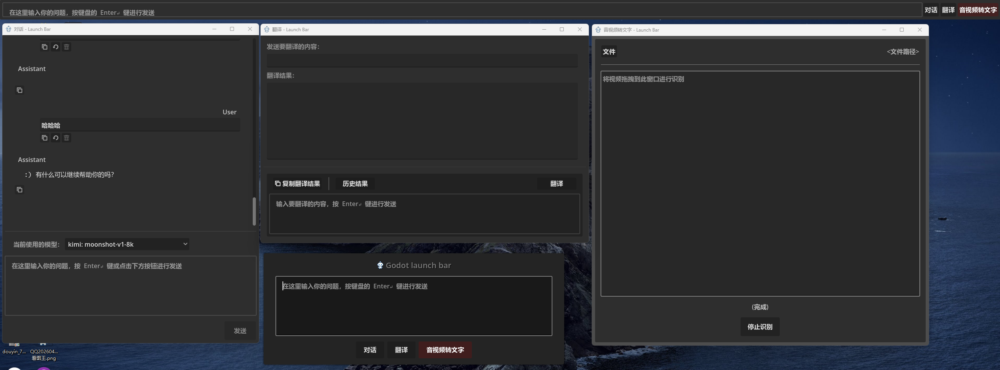

## Godot Launch Bar

> godot 4.7.dev2

通过按下 `Ctrl+Space` 进行弹出启动条。可在代码中更改快捷键

顶部嵌入式工具条，直接输入使用。最右侧的按钮使用右键点击，切换当前的功能，按下回车，启用对应按钮面板的功能。

在当前运行的程序目录或源码的 **tools** 目录下，重写 `BaseProgramButton` 类进行实现启动条中的按钮功能，它会在下次启动的时候，自动加载到启动条里。
